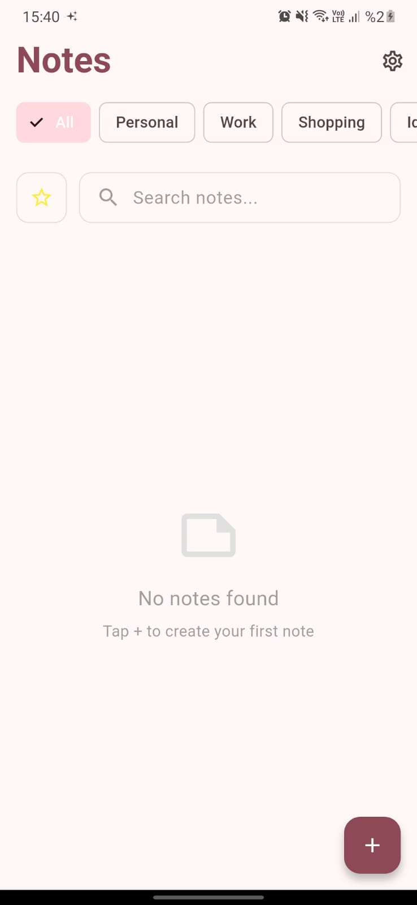
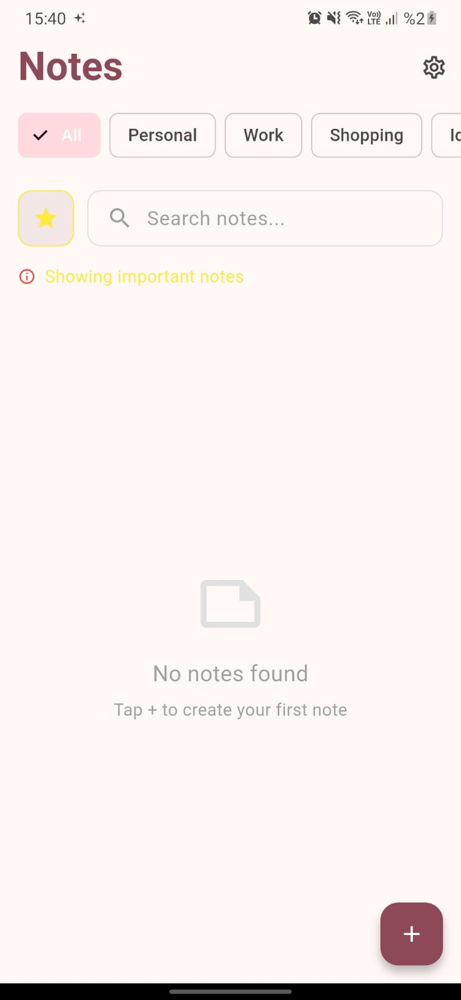
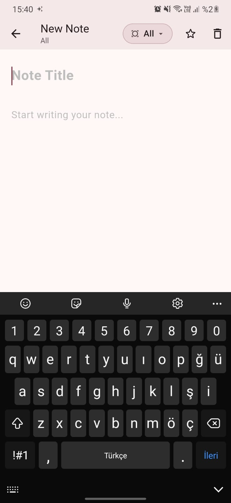
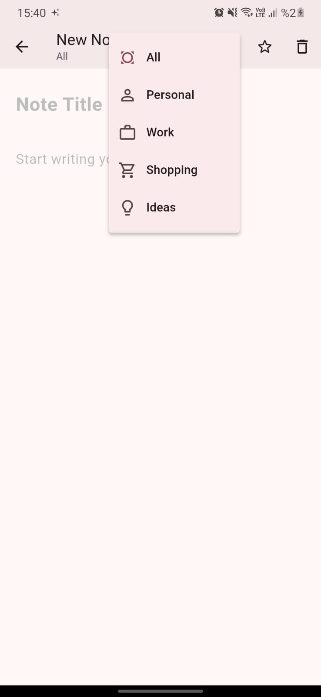
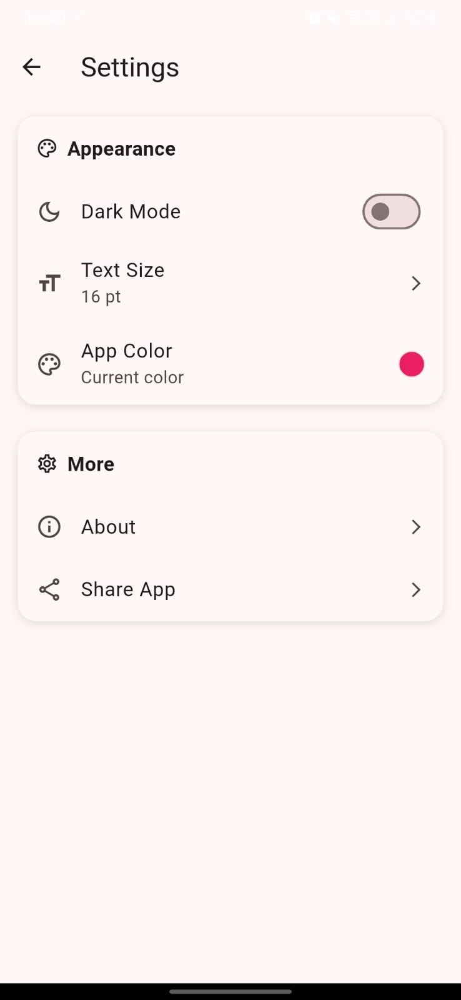

<h1 align="center">📝 Notiq - Smart Notes App</h1>
<h3 align="center">A beautiful and modern note-taking app built with Flutter</h3>

  
  
  
  

## ✨ ScreenShots

## ✨ Features

- 🎨 **Dark/Light Mode** - Automatic theme switching
- 📂 **Categories** - Organize by Personal, Work, Shopping, Ideas
- 🔍 **Smart Search** - Find notes instantly
- ⭐ **Important Notes** - Star your priority notes
- 💾 **Local Storage** - SQLite database, your data stays on device
- 🎨 **Customizable** - Choose colors and text sizes
- 📱 **Material Design** - Modern and clean UI

## 🚀 Getting Started

🛠️ Built With
Flutter - Cross-platform framework

Dart - Programming language

SQLite - Local database

Provider - State management

Material Design - UI components

Notiq-App/

├── lib/

│   ├── screens/          # UI screens

│   ├── component/        # Reusable widgets

│   ├── data/            # Models and enums

│   ├── services/        # Database layer

│   └── provider/        # State management

├── android/             # Android specific files

├── ios/                # iOS specific files

└── privacy-policy/     # Privacy policy page

📄 License

This project is licensed under the MIT License - see the LICENSE file for details.

🔒 Privacy

Your privacy is important. Notiq stores all data locally on your device. No data is collected or shared.

📞 Contact

Onur Kocabıyık - onurkcbyk@hotmail.com

Project Link: https://github.com/onurkcbyk/Notiq-App

